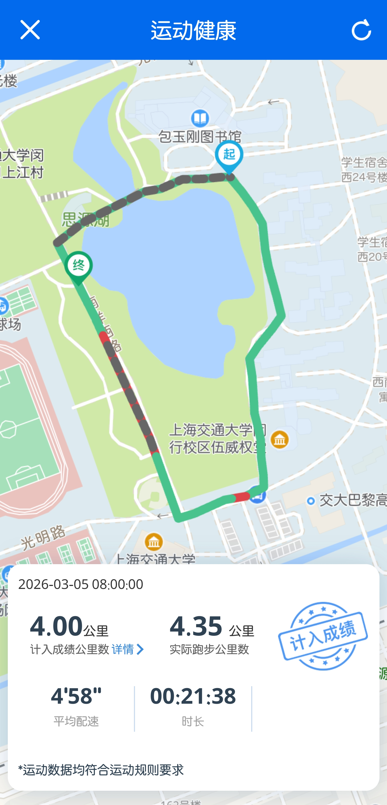

# SJTU 一键校园跑

上海交通大学体育跑步打卡工具。

## 功能

- Jaccount 自动登录，支持验证码自动识别与异地登录二次验证

- 基于预设闭合环路生成模拟跑步轨迹，配速约 4.5min/km，效果如图：

- 自动上传从前一天起连续 25 天的跑步记录，每天 5km

开学不满 25 天时，**部分记录将无效。**

## 使用方式

1. 填写 Jaccount 用户名和密码
2. 点击「一键跑步」
3. 若触发异地登录验证，按弹窗提示选择验证方式并输入验证码
4. 等待上传完成

密码仅用于登录学校服务器，不做任何存储或传输。

## 免责声明

本工具仅供学习和研究目的，开发者不对因使用本工具造成的任何后果负责。请谨慎使用，并遵守所有适用的法律法规和学校规章制度。

---

版本: 2.1.0
日期: 2026年3月6日